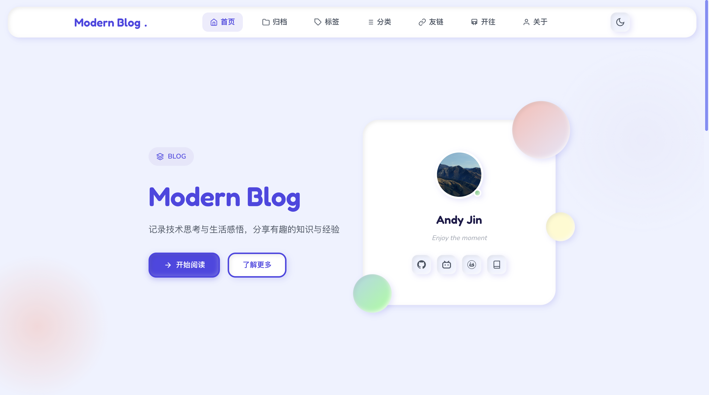

<h1 align="center">Modern Duang</h1>

<p align="center"></p>

<p align="center">
<a title="Hexo Version" target="_blank" href="https://hexo.io/zh-cn/"></a>
<a title="Node Version" target="_blank" href="https://nodejs.org/zh-cn/"></a>
<a title="License" target="_blank" href="https://github.com/PlayWithAndyJin/hexo-theme-modernduang/LICENSE"></a>
<br>
<a title="GitHub Release" target="_blank" href="https://github.com/PlayWithAndyJin/hexo-theme-modernduang"></a>
<a title="Npm Downloads" target="_blank" href="https://www.npmjs.com/package/hexo-theme-modernduang"></a>
<a title="GitHub Commits" target="_blank" href="https://github.com/PlayWithAndyJin/hexo-theme-modernduang"></a>
</p>

<p align="center"><a href="https://themeblog.andyjin.website">主题博客</a> | <a href="https://theme.andyjin.website/zh/index.html">中文指南</a> | <a href="./README_en.md">English README</a></p>

<p align="center">一款简洁优雅的 <a href="https://hexo.io/">Hexo</a> 博客主题，采用柔和的 Claymorphism 设计风格。</p>



## 特性

- **Claymorphism 设计** — 柔和的 3D 粘土质感，蓬松俏皮的视觉风格
- **暗色模式** — 支持跟随系统自动切换或手动切换
- **响应式布局** — 完美适配手机、平板、桌面端
- **灵活导航** — 支持下拉菜单、自定义 SVG 图标、外链新窗口打开
- **分类 & 标签** — 分类页支持自定义图标、颜色和描述
- **友链页面** — 支持友链分组展示，自定义分组图标
- **年度计划** — 首页进度追踪，支持子任务进度条
- **站点数据** — 展示站点运行时长与十年之约倒计时
- **首页 Hero** — 副标题支持固定模式或随机刷新模式
- **自定义引用块** — 内置提示、警告、声明、危险四种风格，带鼠标追踪光效
- **Mermaid 支持** — 文章页内置 Mermaid 图表渲染
- **ICP 备案** — 支持工信部、萌/茶 ICP 备案号与图标
- **Twikoo 评论** — 可配置 envId 和 region 的评论系统
- **自定义页脚** — 支持自定义 HTML 内容、内置社交图标及自定义社交图标
- **RSS 支持** — 头部内置 RSS 链接，支持 RSS 图标

## 安装

```bash
cd your-site
npm install hexo-theme-modernduang --save
```

然后修改 Hexo 站点根目录的 `_config.yml`：

```yaml
theme: modernduang
```

## 配置

将主题的默认配置复制到站点的 `_config.modernduang.yml` 中，按需修改：

```bash
cp themes/modernduang/_config.yml _config.modernduang.yml
```

所有配置项说明见主题目录下的 `_config.yml`。

### 快速上手

```yaml
# 站点信息（自动从 Hexo 主配置的 title 和 description 继承）

# 暗色模式
dark_mode:
  enable: true
  default: light  # 可选 'dark'

# 首页个人信息卡片
profile:
  avatar: https://your-avatar-url.png
  motto: 你的座右铭
  social:
    - name: GitHub
      url: https://github.com/yourname
      icon: github

# 页脚
footer:
  since: 2024
  author: 你的名字
  powered: true
  social:
    travelling: true
    github: true
    email: true
    custom: []
```

## 第三方服务

### 评论系统（Twikoo）

前往 [Twikoo](https://twikoo.js.org/) 获取 `envId`，然后填入配置：

```yaml
comments:
  twikoo:
    envId: https://your-twikoo-envid
    region: ap-shanghai
```

### 友链配置

在 `_config.modernduang.yml` 中配置友链分组和链接：

```yaml
friendGroups:
  技术: 🌟
  生活: 🎨

friends:
  - name: 示例博客
    url: https://example.com
    desc: 一个很棒的博客
    avatar: https://example.com/avatar.png
    group: 技术
```

### ICP 备案

```yaml
footer:
  beian:
    icp: "京ICP备12345678号"  # 工信部备案，完整格式
    moe: "123456"              # 萌备案，只填数字，显示为"萌ICP备123456号"
    chabei: "123456"           # 茶备案，只填数字，显示为"茶ICP备123456号"
```

## 内置社交图标

`profile.social` 和 `footer.social.custom` 支持以下内置图标名：

`github`、`bilibili`、`email`、`blog`、`tiktok`、`kuaishou`、`xiaohongshu`、`wechat`、`qq`、`gitee`、`rss`

也可以直接传入自定义 SVG 字符串：

```yaml
social:
  - name: 我的站点
    url: https://mysite.com
    icon: '<svg viewBox="0 0 24 24">...</svg>'
```

## 自定义引用块

在 Markdown 文章中使用以下标签：

```markdown

这是一条提示信息。



这是一条警告信息。



这是一条声明信息。



这是一条危险警告。

```

## 自定义页脚

可以在页脚插入自定义 HTML 内容：

```yaml
footer:
  custom: '<p>你的自定义 HTML 内容</p>'
```

## 自定义友链申请内容

编辑 `themes/modernduang/layout/_link-apply.md` 即可自定义友链页面的"交换友链"板块。支持以下语法：

- `内容` — 带样式的提示卡片
- `<!-- siteinfo -->` — 自动替换为站点信息（名称、简介、网址、头像、Atom 订阅）
- 标准 Markdown（标题、列表、链接、加粗、斜体）
- `---` — 分割线

## 开源协议

MIT
