<h1 align="center">Modern Duang</h1>

<p align="center">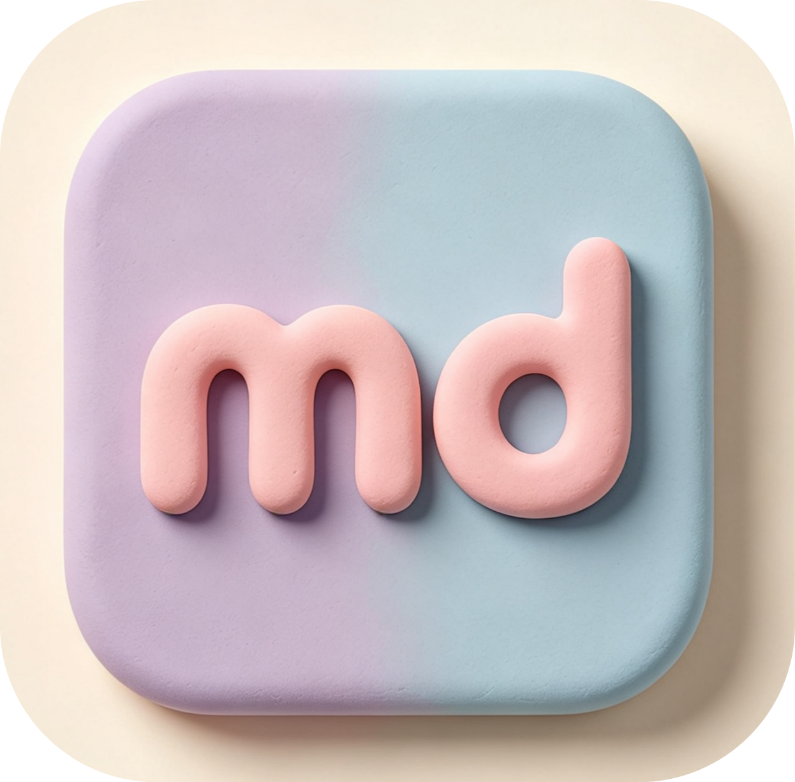</p>

<p align="center">
<a title="Hexo Version" target="_blank" href="https://hexo.io/zh-cn/"></a>
<a title="Node Version" target="_blank" href="https://nodejs.org/zh-cn/"></a>
<a title="License" target="_blank" href="https://github.com/PlayWithAndyJin/hexo-theme-modernduang/LICENSE"></a>
<br>
<a title="GitHub Release" target="_blank" href="https://github.com/PlayWithAndyJin/hexo-theme-modernduang"></a>
<a title="Npm Downloads" target="_blank" href="https://www.npmjs.com/package/hexo-theme-modernduang"></a>
<a title="GitHub Commits" target="_blank" href="https://github.com/PlayWithAndyJin/hexo-theme-modernduang"></a>
<a title="Agent Skills" target="_blank" href="hhttps://github.com/PlayWithAndyJin/modernduang-skills"></a>
</p>

<p align="center"><a href="https://themeblog.andyjin.website">Theme Blog</a> |  <a href="https://theme.andyjin.website">English Instruction</a> | <a href="./README.md">简体中文 README</a> | <a href="https://github.com/PlayWithAndyJin/modernduang-skills">Agent Skills</a></p>

<p align="center">A clean and elegant <a href="https://hexo.io/">Hexo</a> blog theme with soft claymorphism design style.</p>

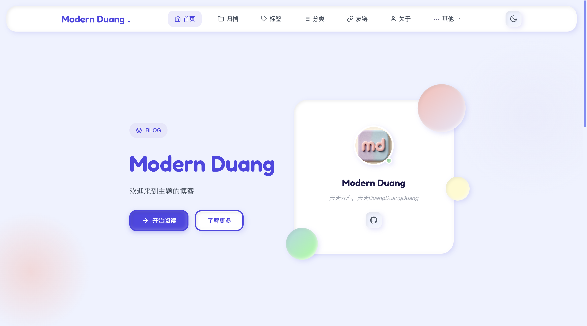

## Features

- **Claymorphism Design** — Soft 3D, puffy, and playful visual style with clay shadows
- **Dark Mode** — Auto-switch based on system preference or manual toggle, with localStorage persistence
- **Responsive Layout** — Fully adapts to mobile, tablet, and desktop screens
- **Configurable Navigation** — Support dropdown menus, custom SVG icons, and external links
- **Categories & Tags** — Rich category pages with custom icons, colors, and descriptions
- **Friend Links** — Categorized friend links with custom groups and emoji icons
- **Annual Plans** — Progress tracking section on homepage with sub-task progress bars
- **Site Stats** — Uptime counter (since any date) and 10-year promise countdown
- **Custom Hero** — Homepage subtitle supports fixed or random mode from config
- **Custom Blockquotes** — Note, Warning, Declare, Danger styled quote blocks with mouse-tracking glow effect
- **Mermaid Support** — Built-in Mermaid diagram rendering for post pages
- **ICP Beian** — Supports MIIT, Moe, and Chabei ICP registrations with icons
- **Twikoo Comments** — Built-in Twikoo comment system
- **Post Visibility** — Hide posts from listings or globally with 404
- **Custom Footer** — Support custom HTML content, built-in and custom social icons
- **RSS Support** — Built-in RSS link in head and configurable RSS icon

## Samples

| Home Hero | Latest Posts | Annual Plan |
|-----------|-------------|-------------|
|  | 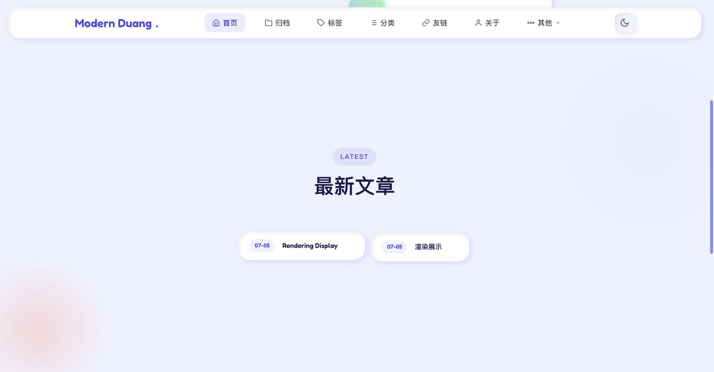 | 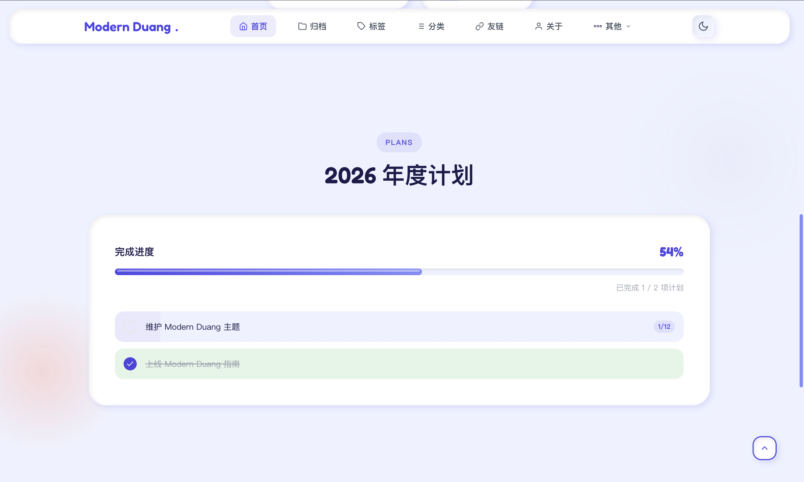 |

| Site Stats | Blog Post |
|-----------|-----------|
| 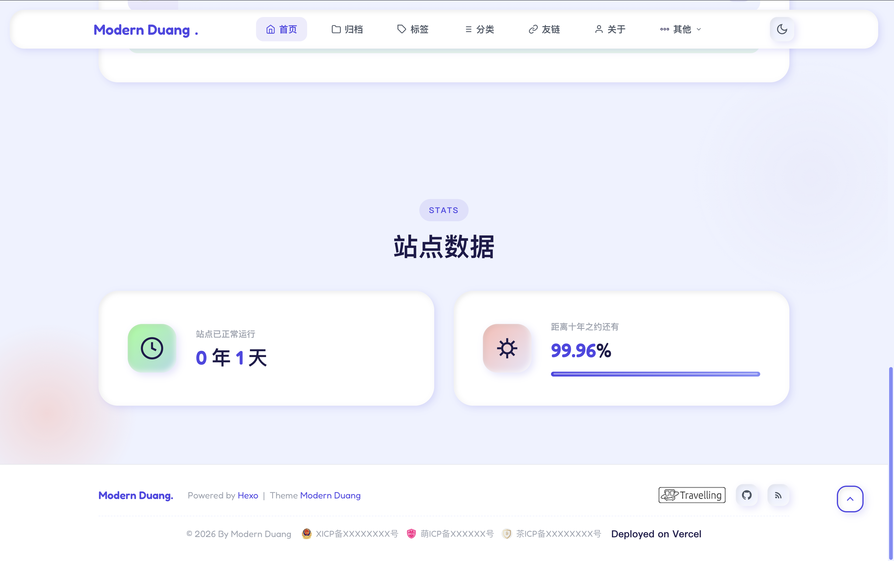 | 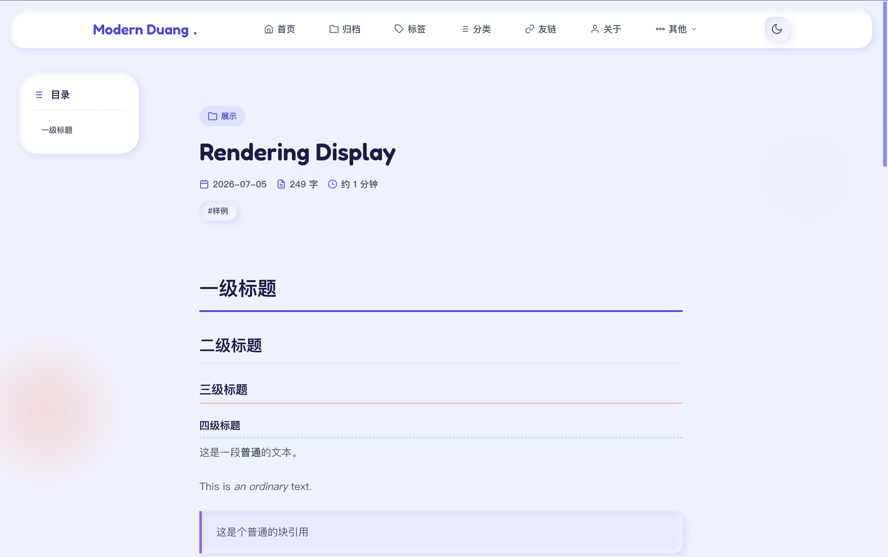 |

| Archive | Categories | Tags |
|---------|-----------|------|
| 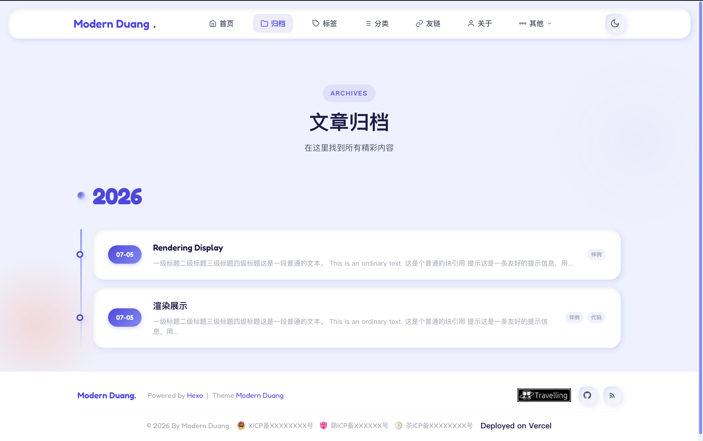 | 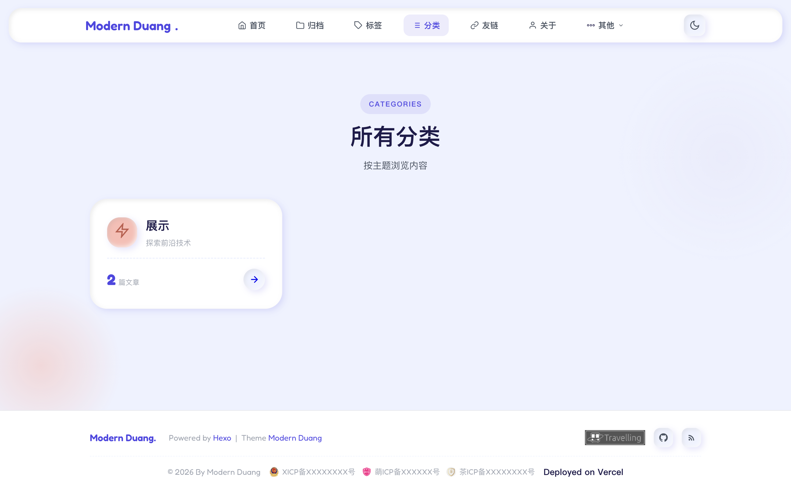 | 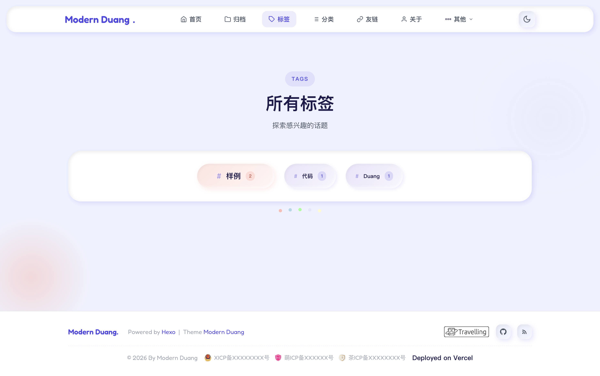 |

| Category Detail | Tag Detail |
|----------------|-----------|
| 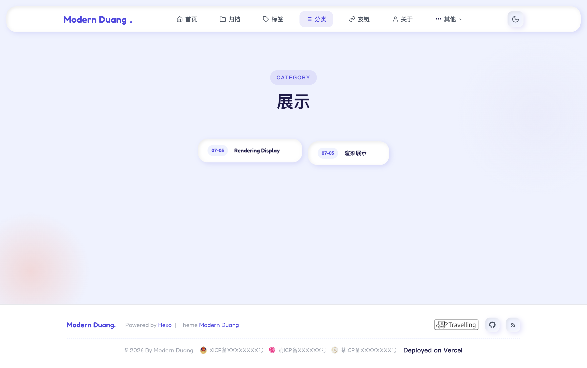 | 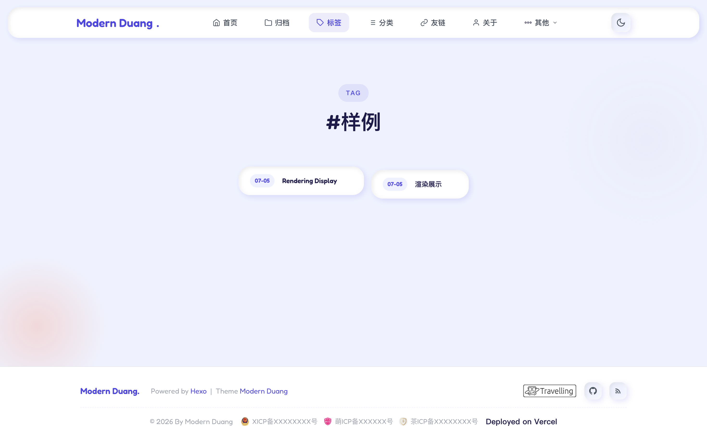 |

| Friend Links | About |
|-------------|-------|
| 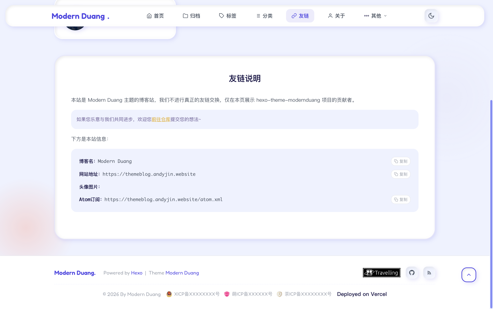 | 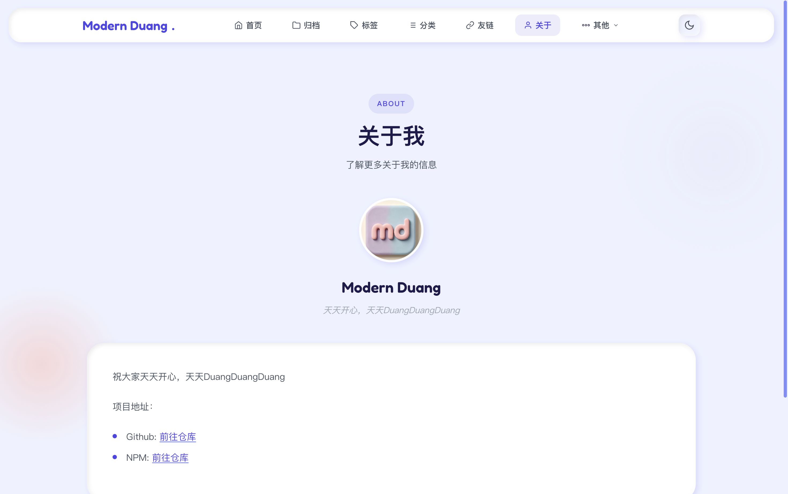 |

## Installation

```bash
cd your-site
npm install hexo-theme-modernduang --save
```

Then modify `_config.yml` in your Hexo site root:

```yaml
theme: modernduang
```

## Configuration

Copy the theme's `_config.yml` into your site's `_config.modernduang.yml` and customize it to your needs.

```bash
cp themes/modernduang/_config.yml _config.modernduang.yml
```

See the theme's `_config.yml` for all available options with inline documentation.

### Quick Start

```yaml
# Site info (inherited from Hexo config)
# title and description are read from Hexo's main _config.yml

# Dark mode
dark_mode:
  enable: true
  default: light  # or 'dark'

# Profile card on homepage
profile:
  avatar: https://your-avatar-url.png
  motto: Your motto here
  social:
    - name: GitHub
      url: https://github.com/yourname
      icon: github

# Footer
footer:
  since: 2024
  author: YourName
  powered: true
  social:
    travelling: true
    github: true
    email: true
    custom: []
```

## Third-party Services

### Comments (Twikoo)

Deploy your Twikoo backend and get the `envId` from [Twikoo](https://twikoo.js.org/), then set it in the config:

```yaml
comments:
  enable: true
  twikoo:
    envId: https://your-twikoo-envid
```

> Self-hosted Twikoo (Vercel etc.) does not need the `region` parameter.

### Friend Links

Configure friend groups and links in `_config.modernduang.yml`:

```yaml
friendGroups:
  技术: 🌟
  生活: 🎨

friends:
  - name: Example Blog
    url: https://example.com
    desc: A great blog
    avatar: https://example.com/avatar.png
    group: 技术
```

### ICP Beian

```yaml
footer:
  beian:
    icp: "京ICP备12345678号"  # Full format
    moe: "123456"              # Numbers only, displays as "萌ICP备123456号"
    chabei: "123456"           # Numbers only, displays as "茶ICP备123456号"
```

## Built-in Social Icons

The following icon names are available for `profile.social` and `footer.social.custom`:

`github`, `bilibili`, `email`, `blog`, `tiktok`, `kuaishou`, `xiaohongshu`, `wechat`, `qq`, `gitee`, `rss`

You can also use custom SVG strings:

```yaml
social:
  - name: My Site
    url: https://mysite.com
    icon: '<svg viewBox="0 0 24 24">...</svg>'
```

## Custom Blockquotes

Use these tags in your Markdown posts:

```markdown

This is a note blockquote.



This is a warning blockquote.



This is a declaration blockquote.



This is a danger blockquote.

```

## Custom Footer Content

You can add custom HTML to the footer:

```yaml
footer:
  custom: '<p>Your custom HTML content</p>'
```

## Post Visibility

Set the `visibility` field in your post's Front Matter:

```yaml
---
title: My Post
visibility: local   # Hidden from listings, accessible via direct URL
---

---
title: My Post
visibility: global  # Completely hidden, returns 404
---
```

Leave empty for normal visibility.

## Custom Link Apply Content

Edit `themes/modernduang/layout/_link-apply.md` to customize the "Exchange Links" section on the links page. Supported syntax:

- `content` — Styled note block
- `<!-- siteinfo -->` — Replaced with site info (name, desc, url, avatar, atom)
- Standard Markdown (headings, lists, links, bold, italic)
- `---` — Divider line

## License

MIT
